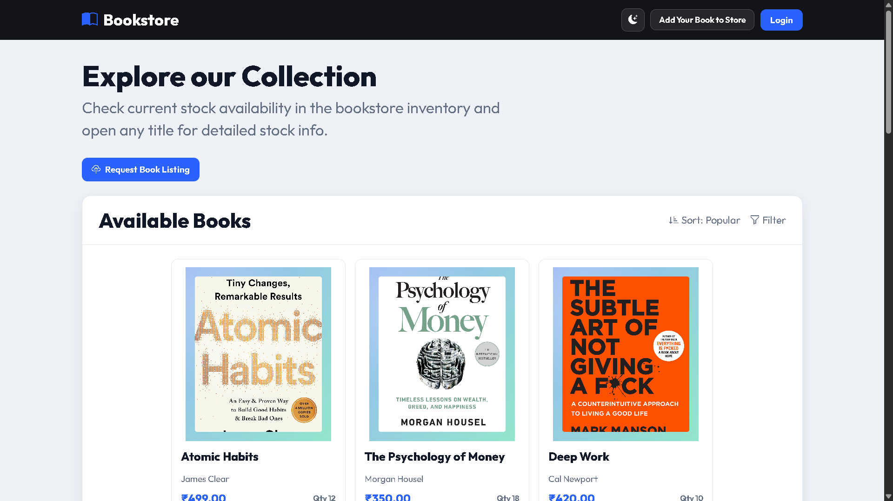
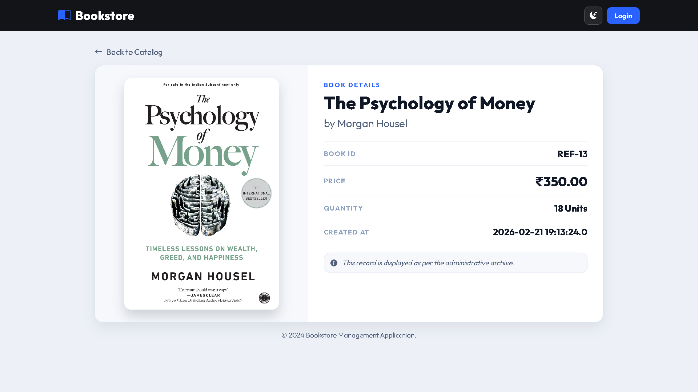
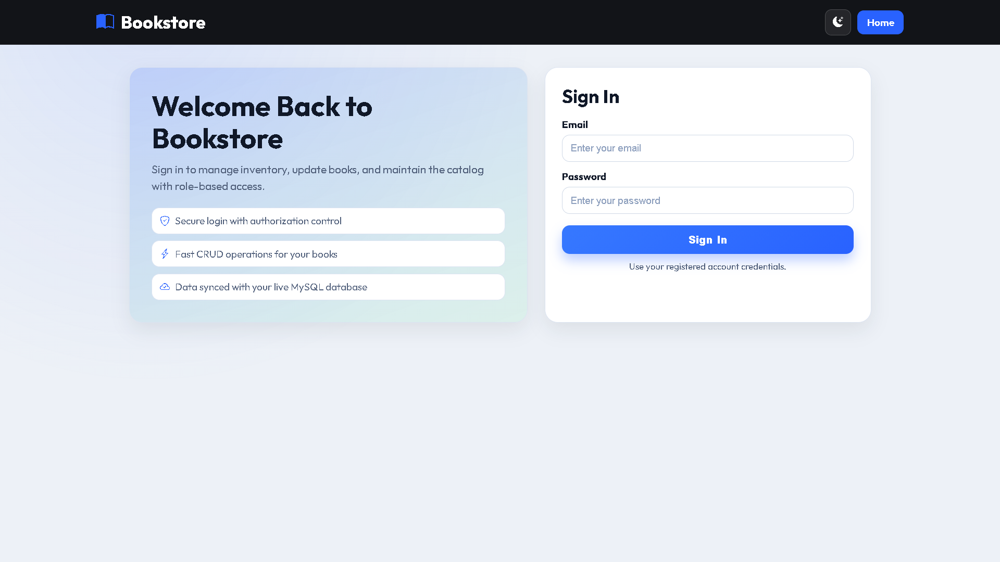
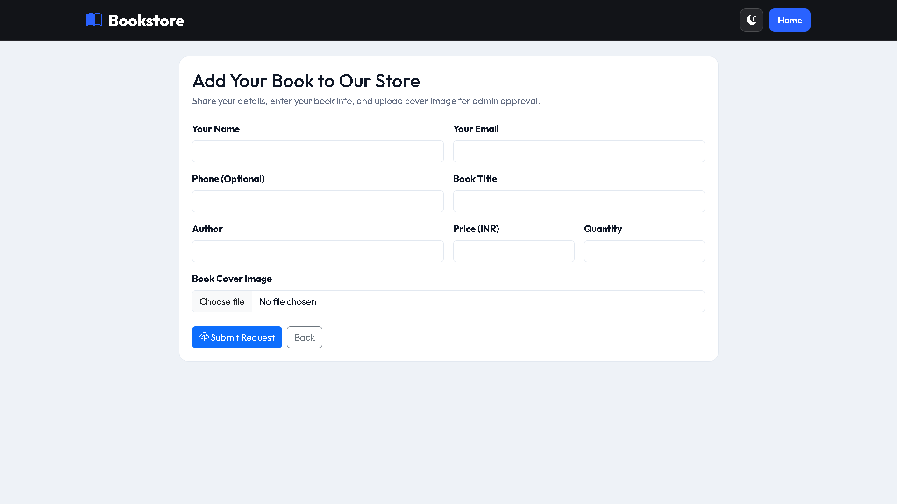
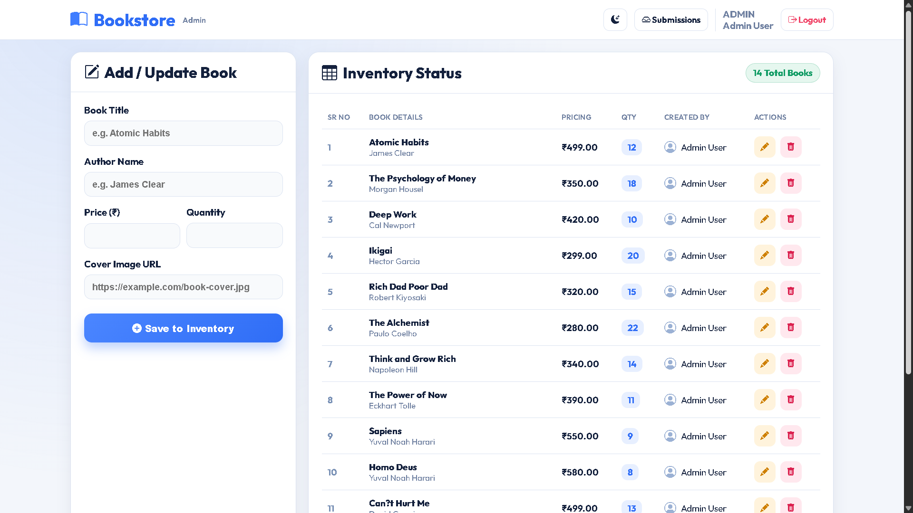

# Bookstore Mini Project

A modern JSP, Servlet, JDBC, and Hibernate based bookstore application with a clean UI, role-based access, book management, and a public book submission flow.

## Highlights

- Browse the public bookstore catalog and open book details.
- Sign in with role-based authentication for protected admin features.
- Add, update, and delete books from the inventory.
- Submit new book requests with cover image upload support.
- Review submitted book requests from the admin side.
- Backed by MySQL and configured through a datasource-friendly Java EE stack.

## Tech Stack

- Java 8
- JSP and Servlets
- JDBC
- Hibernate ORM
- JSTL
- MySQL
- Apache Tomcat 9+
- Maven

## Screenshots

### Public catalog

<p align="center">
  
  
</p>

### Authentication and requests

<p align="center">
  
  
</p>

### Admin inventory

<p align="center">
  
</p>

## Project Structure

- `src/main/java/org/example/controller` - servlet controllers for home, auth, books, submissions, and utility pages.
- `src/main/java/org/example/dao` - data access layer for books, users, and submissions.
- `src/main/java/org/example/model` - entity classes mapped with Hibernate.
- `src/main/java/org/example/filter` - authentication and role filters.
- `src/main/webapp/WEB-INF/views` - JSP views for the application screens.
- `src/main/resources` - database and Hibernate configuration.
- `ScreenShots` - project screenshots used in this README.

## Configuration

The application uses the following default database settings:

- Database: `bookstore_mini`
- Username: `root`
- Password: `mysql@database`
- Driver: `com.mysql.cj.jdbc.Driver`

You can update these values in:

- [src/main/resources/db.properties](src/main/resources/db.properties)
- [src/main/resources/hibernate.cfg.xml](src/main/resources/hibernate.cfg.xml)

## Run Locally

1. Create a MySQL database named `bookstore_mini`.
2. Update the MySQL username and password in the configuration files if needed.
3. Build the project with Maven:

```bash
mvn clean package
```

4. Deploy the generated WAR file from `target/bookstore.war` to Tomcat.
5. Open the application in your browser after deployment.

## Main Routes

- `/home` - public catalog page
- `/auth` - login page
- `/app/books` - protected inventory management page
- `/submit-book` - public book request form
- `/rewrite-demo` - URL rewrite demo page
- `/error` - custom error page

## Notes

- The admin inventory page supports add, update, and delete operations.
- The submission form uploads cover images and stores them as pending requests.
- Session timeout and custom error handling are configured in `WEB-INF/web.xml`.

## License

This project is licensed under the MIT License.
